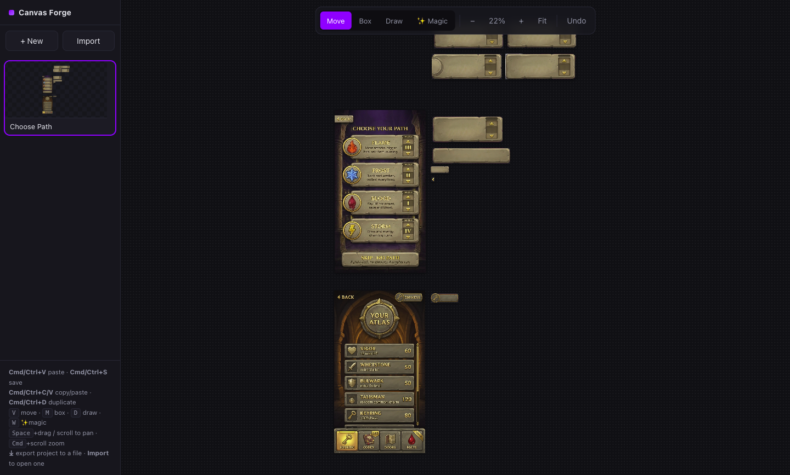

# Canvas Forge

A desktop **infinite canvas for AI image editing** — paste an image, select any region, describe a change, and Gemini regenerates *only* that region in place. Built for game‑UI and asset work: extract elements onto transparency, remove backgrounds, run many edits at once, and save straight to disk.

Canvas Forge is an Electron app (macOS‑first) built with electron‑vite + React + TypeScript. All image processing runs locally in the renderer via the 2D canvas (no native modules); the Google Gemini API is called from the main process so your API key never touches the renderer.

<!--
  Screenshot of Canvas Forge in action: an infinite canvas with pasted game‑UI frames,
  a selected frame, the tool/action toolbar, and in‑flight "Extracting" placeholders.
-->


## Features

- **Local region inpainting.** Box‑ or brush‑select part of an image, type a prompt, and only that area is regenerated. The whole frame is sent to Gemini for context plus a mask marking the region, and just the masked region is composited back over the pristine original — so nothing outside the selection drifts.
- **✨ Magic select.** Describe an element ("the keys counter, top right") and Gemini returns a tight bounding box as your selection. Boxes are draggable and corner‑resizable to fine‑tune.
- **Whole‑frame actions.** Click a frame to select it edge‑to‑edge (no hand‑drawn box that clips pixels), then Extract or Generate on the complete frame.
- **Extract, two algorithms.** *Isolate element* cuts the named element out onto a transparent background with text removed; *Background only* removes the foreground + text and keeps the reconstructed background scene.
- **Remove background.** One click keeps the subject and cuts everything behind it to transparency (Gemini paints the background magenta, then it's chroma‑keyed out).
- **References.** Box‑select regions of other images to use as visual guides for a generation (multi‑image prompting).
- **Many at once.** Extractions and generations run as detached, concurrent jobs — fire several, each shows its own animated loading placeholder. Placeholders are **draggable** (pre‑position where the result lands) and land clear of existing images so results never overlap. Cancel any single job from its placeholder.
- **1–10 variations** per run, laid out side by side.
- **Non‑destructive.** Originals are always kept; results appear beside them.
- **Local projects on disk.** Projects, prompt history and settings are real files in the app's user‑data folder. Export/import a project as a single file.
- **Save & share.** Save any image as a PNG (with a "Reveal in Finder" shortcut) or copy it to the system clipboard (alpha preserved).
- **Model choice.** Best (Gemini 3 Pro Image / "Nano Banana Pro", best text fidelity) or Fast (Gemini 2.5 Flash Image).

## Keyboard shortcuts

- `V` move · `M` box select · `D` draw (brush) select · `W` ✨ magic
- `Space`+drag or scroll to pan · `Cmd`+scroll to zoom
- `Cmd/Ctrl+V` paste image · `Cmd/Ctrl+C` copy · `Cmd/Ctrl+D` duplicate
- `Cmd/Ctrl+S` save project · `Cmd/Ctrl+Z` undo
- `Cmd/Ctrl+Enter` run the current Generate

## Getting started

```bash
npm install
npm run dev      # launches the desktop app
```

Provide a Google Gemini API key one of these ways (checked in order): a `GEMINI_API_KEY` (and optional `GEMINI_API_KEY_2…9` for quota fallback) in your environment, a `.env` / `.env.local` in the project root, or the app's settings file. **The key stays in the main process and is never bundled or committed** (`.env*` is git‑ignored).

## Build

```bash
npm run typecheck
npm run build         # type‑checks then builds
npm run build:mac     # package a macOS app (electron‑builder)
```

## Tech stack

electron‑vite · Electron · React · TypeScript · Google Gemini image API. Image processing (crop, feathered‑mask composite, magenta chroma‑key) is done with the 2D canvas — deliberately no `sharp` / native modules, to keep packaging simple.

## License

[MIT](LICENSE) © 2026 pumanitro
